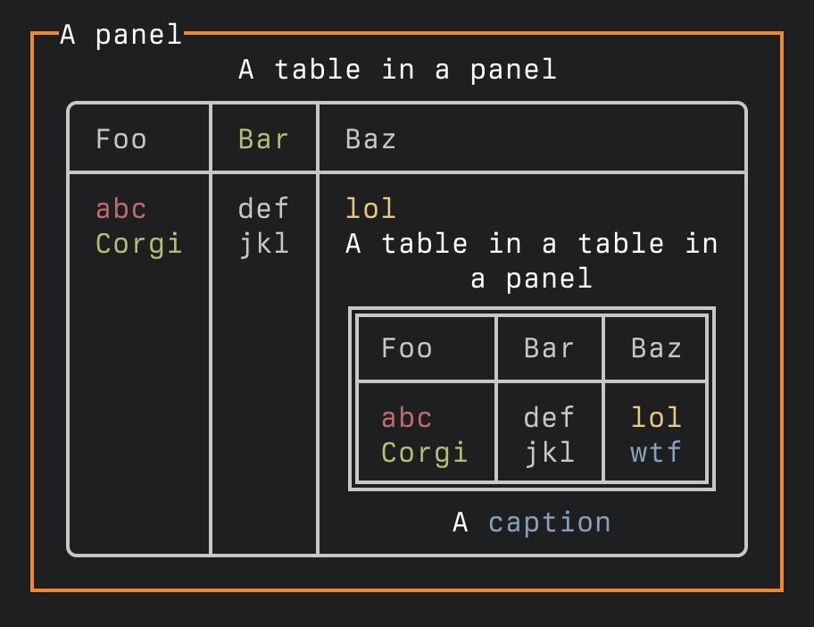

# `SpectreKit`

A Swift library that makes it easier to create beautiful terminal applications.  

It is a port of [Spectre.Console](https://spectreconsole.net) which in turn is heavily inspired by 
the excellent Python library, [Rich](https://github.com/Textualize/rich).

> [!NOTE]
> SpectreKit is currently under development, and many things are still missing.

## Example



```swift
import SpectreKit

let console = Console()

console.write(
    Panel(
        Table()
            .addColumns("Foo", "[green]Bar[/]", "Baz")
            .addRow(Markup("[red]abc[/]"), Text("def"), Markup("[yellow]lol[/]"))
            .addRow(
                Markup("[green bold]Corgi[/]"), Text("jkl"),
                Table()
                    .addColumn("Foo")
                    .addColumn("Bar")
                    .addColumn("Baz")
                    .addRow(Markup("[red]abc[/]"), Text("def"), Markup("[yellow]lol[/]"))
                    .addRow(Markup("[green bold]Corgi[/]"), Text("jkl"), Markup("[blue]wtf[/]"))
                    .setBorder(TableBorder.doubleEdge)
                    .setTitle("A table in a table in a panel")
                    .setCaption("A [blue]caption[/]")
            )
            .setTitle("A table in a panel")
            .setBorder(TableBorder.rounded)
    )
    .setHeader("[white]A panel[/]")
    .setBorderColor(Color.rgb(128, 128, 0)))
```